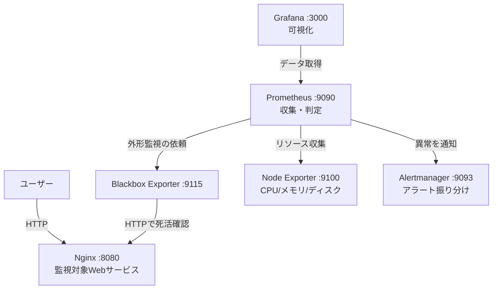

# 監視基盤ポートフォリオ（Prometheus + Grafana）

Docker Compose を用いて、Webサービスの死活・外形・リソースを監視する
運用監視基盤を構築した。監視の設計から、意図的な障害試験による動作検証、
障害報告書（ポストモーテム）の作成までを一貫して実施している。

## 目的
未経験からインフラエンジニア（運用監視）を目指すにあたり、
「監視を構築できる」だけでなく「監視が正しく機能することを検証し、
障害対応を記録できる」ことを示すために作成した。

## 構成



## 使用技術
| 種別 | 技術 |
|---|---|
| コンテナ基盤 | Docker / Docker Compose |
| 監視 | Prometheus |
| 可視化 | Grafana |
| アラート | Alertmanager |
| メトリクス収集 | Node Exporter（リソース）/ Blackbox Exporter（外形） |
| 監視対象 | Nginx |

## 監視の3本柱
- **死活監視**：サービスが生きているか（Blackbox Exporter）
- **外形監視**：ユーザー目線でHTTP応答が正常か（Blackbox Exporter）
- **リソース監視**：CPU/メモリ/ディスクに余力があるか（Node Exporter）

## 起動方法
```bash
docker compose up -d
```

各サービスへのアクセス：
| サービス | URL |
|---|---|
| 監視対象Nginx | http://localhost:8080 |
| Prometheus | http://localhost:9090 |
| Grafana | http://localhost:3000 |
| Alertmanager | http://localhost:9093 |

## 実施した障害試験
監視対象のNginxを意図的に停止させ、以下を検証した。

1. 外形監視（probe_success）が異常を検知（1 → 0）
2. WebServiceDown アラートが発報（PENDING → FIRING）
3. Alertmanager への通知到達
4. 復旧作業とアラート解消の確認

詳細は [障害報告書](docs/incident-report-001.md) を参照。

## ドキュメント
- [監視設計書](docs/monitoring-design.md)：閾値の根拠と設計思想
- [障害報告書 #001](docs/incident-report-001.md)：障害試験の記録

## 工夫した点
- アラートに `for` 句を設定し、瞬間的な異常での誤報を防止
- severity（critical / warning）を分け、対応の優先度を明確化
- ディスク監視を2段階（20% / 10%）に設計し、予兆と危機を区別
- 各閾値に根拠を持たせ、設計思想を監視設計書として文書化